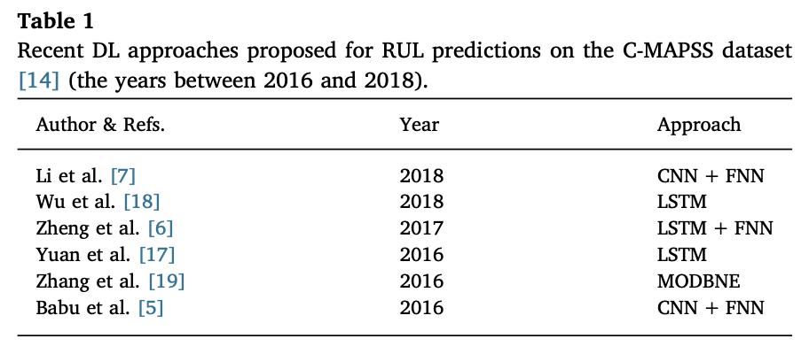

# 题目 #

- **原标题：Remaining useful life predictions for turbofan engine degradation using semi-supervised deep architecture**
- **中文翻译：使用半监督深度架构预测涡轮风扇发动机退化的剩余使用寿命**

# 作者

- **André Listou Ellefsen**  

   *Department of Ocean Operations and Civil Engineering, Norwegian University of Science and Technology, Aalesund 6009, Norway*

- **Emil Bjørlykhaug**
  *Department of Ocean Operations and Civil Engineering, Norwegian University of Science and Technology, Aalesund 6009, Norway*

- **Vilmar Æsøy**
  *Department of Ocean Operations and Civil Engineering, Norwegian University of Science and Technology, Aalesund 6009, Norway*

- **Sergey Ushakov**
   *Department of Marine Technology, Norwegian University of Science and Technology, Trondheim 7491, Norway*

- **Houxiang Zhang**
  *Department of Ocean Operations and Civil Engineering, Norwegian University of Science and Technology, Aalesund 6009, Norway*

# 摘要

近年来，相关研究已经提出了一些深度学习的方法，应用于预测和健康管理（PHM）中，提供可靠的剩余使用寿命（RLU）的预测。尽管受监督的深度学习技术（例如卷积神经网络和长短期记忆网络）的性能优于传统的预测算法，但是深度学习技术与传统的预测算法一样，仍然依赖于大型的可用与训练的标记数据集。对于现实生活中的PHM应用，想要获取高质量的、带有标记的训练数据，不仅比较困难，并且还需耗费大量的时间。无监督的深度学习技术引入了预训练，用来自动从原始的、未标记过的数据中提取出性能退化相关的特征。因此，将无监督学习和监督（半监督）学习相结合，有望提高剩余寿命RUL的预测精度，甚至可以减少训练所需的数据量。本文研究了无监督预训练在使用半监督状态下对RUL预测中的效果。此外，还使用了遗传算法（GA）来调整训练过程中的各种超参数。本文提出的半监督深度学习架构的有点已经在流行的C-MAPSS数据集上得到了验证。实验将该方法与纯监督的训练方法进行了比较，无论是在训练数据完全标记的情况下还是在标记的训练数据减少的情况下，都与文献中最稳健的结果进行了对比。结果表明，无监督预训练是多工况和故障模式下RUL预测的一个有价值的研究方向。

# 关键字

- **C-MAPSS  **    C-MAPSS

- **深度学习**    Deep learning

- **遗传算法**    Genetic algorithm

- **预测与健康管理**   Prognostics and health management

- **剩余使用寿命**   Remaining useful life

- **半监督学习**   Semi-supervised learning

  

# 引言

剩余使用寿命（RUL）是一个技术术语，用于描述预测和健康管理（PHM）应用程序中的故障进展<a href="#ref1">[1]</a>。预测算法倾向于通过预测组件或子组件（即RUL<a href="#ref2">[2]</a>）内发生故障之前的可用时间来实现理想的维护策略。通过这种方式，RUL预测有可能防止严重故障，因此，成为实现工业系统零停机性能最终目标的重要衡量标准。然而，传统的预测算法难以准确处理当今序列数据中增加的复杂性。

最近，深度学习（DL）已成为一个强有力的领域，可以在PHM领域内以最少的人工输入处理高度非线性和变化的序列数据<a href="#ref3">[3]</a>。今天，DL是机器学习的一个极其活跃的子领域。随着处理能力的提高和图形处理器的不断发展，随着计算负担的显著降低，DL有可能改进预测任务<a href="#ref4">[4]</a>。然而，深度架构引入了许多不同的超参数，这些参数在训练过程中很难优化。因此，本研究提出了一种遗传算法（GA）方法，以有效地优化超参数。

DL技术，如卷积神经网络（CNN）和长短期记忆（LSTM），在涡轮风扇发动机退化的RUL预测中显示出快速发展并优于传统预测算法<a href="#ref10">[5-7]</a>。DL技术预测RUL，而无需任何发动机退化机制的先验知识。因此，今天的数据分析师将他们关于RUL预测问题的知识应用于DL技术的选择和设计，而不是应用于特征工程。然而，CNN和LSTM都依赖于纯监督学习。换句话说，他们在训练过程中需要大的标记训练数据集。因此，RUL预测精度很大程度上取决于构建的运行到失败训练数据标签的质量。

相比之下，无监督DL技术引入了初始预训练阶段，以自动从未标记的原始训练数据中提取高级抽象特征。因此，无监督和有监督（半监督）学习的组合具有甚至更高的RUL预测精度的潜力，因为在进行监督微调以最小化全局训练目标之前，权重在接近良好局部最小值的区域中初始化[8]。

更先进和最新的激活函数[9]、学习率方法[10]、正则化技术[11]和权重初始化[12,13]确实减少了当训练数据被完全标记时，在各种领域中无监督预训练的需求。然而，在现实的PHM应用中，高质量的运行到故障标记训练数据并不容易获得，尤其是从新设备中。然而，半监督设置中的无监督预训练有可能以高RUL预测精度执行，即使在微调过程中标记的训练数据量减少。此外，在实际PHM应用中收集的大多数数据都受到多种操作条件和故障模式的影响。这增加了固有的退化复杂性，这使得预测算法更难直接发现输入数据中的明显趋势。为了解决这个问题，可以使用初始的无监督预训练阶段。无监督预训练在有监督的微调之前提取更多与退化相关的特征，因此，有可能支持整个体系结构更好地理解潜在的退化现象。

本文的目的是展示无监督预训练在使用半监督设置的RUL预测中的效果。这些结果在NASA制作并提供的公开商用模块化航空推进系统仿真（C-MAPSS）数据集中的四个不同模拟涡轮风扇发动机降级数据集上得到了验证[14]。本研究的主要贡献如下：

- GA方法有效地调整了深度架构中的超参数。
- 当训练数据被完全标记时，半监督学习与具有多个操作条件和故障模式的多变量时间序列数据中的监督学习相比，提高了RUL预测精度。
- 当微调过程中的标记训练数据减少时，与监督学习相比，半监督学习执行更高的RUL预测精度。

本文的总体结构如下。第2节介绍了C-MAPSS数据集的最新和相关工作。第3节介绍了GA的必要背景和拟议的半监督设置。第4节讨论了实验方法、结果和讨论。最后，第5节总结并结束了本文，并为今后的工作提供了方向。

# 相关工作

C-MAPSS数据集已广泛用于评估RUL预测的几种DL方法。本节回顾了应用于C-MAPSS数据集的最新研究。所选研究在所提出的深度架构中使用卷积神经网络（CNN）、深度信念网络（DBN）或长短期记忆（LSTM）。

在大多数PHM应用中，顺序数据是输入数据的标准格式，例如压力和温度时间序列数据。LSTM是一种成熟的DL技术，用于处理序列数据。最初的LSTM[15]是在20世纪90年代早期开发的，当时研究人员在传统递归神经网络（RNN）中发现了一个消失和爆炸的梯度问题[16]。这个问题证实了传统RNN难以学习长期依赖性。为了解决这个问题，LSTM引入了一个存储单元，用于调节单元内外的信息流。因此，存储单元能够在长时间内保持其状态，即学习可能影响未来预测的长期依赖性。Yuan等人提出了几种不同断层的LSTM方法[17]。将所提出的方法与传统的RNN、门控递归单元LSTM（GRU-LSTM）和AdaBoost LSTM进行了比较。它在所有情况下都显示出了改进的性能。郑等人提出了另一种LSTM方法。[6]。所提出的方法使用两个LSTM层、两个前馈神经网络（FNN）层和一个输出层提供RUL预测。LSTM层能够揭示C-MAPSS数据集中的隐藏模式，与隐马尔可夫模型或传统RNN相比，LSTM层实现了更高的准确性。Wu等人提供了类似的研究[18]。在本研究中，LSTM与动态差分方法相结合，以便在训练过程之前从多个操作条件中提取新的特征。这些特征包含重要的退化信息，可改进LSTM以更好地控制潜在的物理过程。与传统的RNN和GRU-STM相比，所提出的方法显示出增强的性能。

尽管神经网络在二维和三维网格结构拓扑数据上表现出色，例如物体识别[20]和人脸再认知[21]，但神经网络也可以应用于PHM应用中的一维网格结构拓扑序列数据。Babu等人提出了一种新的用于RUL预测的CNN方法[5]。该CNN方法包括两个具有卷积和平均池化步骤的层，以及执行RUL预测的最终FNN层。与多层感知器（MLP）、支持向量机（SVM）和相关向量机相比，所提出的方法提高了精度。最近，[7]采用了CNN的方法。在这项研究中，与[6]中的LSTM方法和[5]中的CNN方法相比，Li等人在C-MAPSS数据集上获得了更高的精度。他们采用了最近开发的、经过验证的正则化技术“dropout”[11]和自适应学习率方法“adam”[10]。

Hinton等人在2006年引入了贪婪分层无监督学习算法，将其设计用于DBN[22]。DBN由堆叠的受限玻尔兹曼机器（RBM）组成，其中先前RBM中的隐藏层将用作当前RBM的输入层。该算法执行初始无监督预训练阶段，以自动从输入数据中学习内部表示。接下来，执行有监督的微调以最小化训练目标。Zhang等人提出了一种多目标DBN集成方法[19]。该方法将多目标进化集成学习框架与DBN训练过程相结合。一致地，所提出的方法在组合进化的DBN来执行RUL预测之前创建了多个具有不同准确性和多样性的DBN。在平均训练误差为单一目标的情况下，通过差异进化优化组合DBN。该方法优于几种传统的机器学习算法，如SVM和MLP。表1总结了最近的研究。

这些研究都在训练过程中使用了完全标记的运行到失败训练数据集。然而，在现实生活中的PHM场景中，积累的大多数数据都是非结构化的，并且从一开始就没有标记。

构建从运行到失败的数据标签需要有价值的领域知识。这是一个耗时且具有挑战性的过程。因此，本研究将研究半监督设置中无监督预训练的效果，包括减少的和完全标记的训练数据集。

# 提出半监督设置

# 实验研究

# 总结和研究展望

本文利用半监督设置研究了无监督预训练在RUL预测中的作用。实验在公开可用的C-MAPSS数据集上进行。此外，还提出了一种GA方法来调整深度架构中不同超参数的数量。将表3中的所有超参数组合在一起，得到总共8 748 000个组合。尽管GA方法仅使用了20个个体和三个进化，但它能够有效地优化C-MAPSS数据集中每个子集的超参数。与使用耗时、详尽的搜索相比，这是一种很有前途的方法。然而，在未来的工作中，将进一步优化每个子集60小时的平均训练时间。

在实验研究中，将所提出的半监督设置与纯监督训练以及文献中的最新研究进行了比较。所提出的半监督设置在完全和减少标记训练数据量的情况下实现了有希望的RUL预测精度。因此，无监督预训练确实是现实生活中PHM应用中的一个误导性特征，因为大量高质量的标记训练数据可能既具有挑战性又耗时，这些PHM应用会受到多种操作条件和故障模式的影响。无监督的预训练支持深度架构，通过提取更多包含重要退化信息的特征来提高我们对固有复杂性的理解。

在本研究中，RBM被用作初始的无监督预训练阶段。然而，RBM是一种相当古老的、无监督的DL技术。今天，可以使用更强大的无监督DL技术。例如，VAE[36，37]似乎很有希望。VAE使用变量推理对训练数据的潜在概率分布进行建模。它可以扩展到广泛的模型体系结构，这是它与RBM相比的关键优势之一，RBM需要仔细的模型设计来保持可操作性[38]。

在基于数据驱动方法（如DL）的RUL预测中，准确度很大程度上取决于构建的运行到失败训练数据标签的质量。这项研究证实，Rc对每个子集的RUL预测精度有显著影响。然而，本研究中使用的分段线性退化模型被认为是一个主要限制，因为每个子集中的每个引擎实际上都有一个单独的退化模式。最近，通过应用重建误差作为异常分数，VAE已用于基于无监督重建的异常检测[39]。因此，在未来的工作中，VAE也将用于创建无监督故障检测器，以优化C-MAPSS数据集中每个子集中每个发动机的Rc。

通常，tanh用作LSTM中的输入和输出（I/O）激活函数。然而，在这项研究中发现，sig-moid作为LSTM I/O激活功能，与ReLU作为激活功能的初始RBM层相结合，表现优于tanh。一个新的校正LSTM I/O激活功能将是一个积极的贡献，将被纳入未来的工作。

# 致谢

这项工作得到了挪威科学技术大学海洋作业和土木工程系90329106号项目的支持，并得到了挪威研究委员会245613/O30号赠款的资助。作者要感谢Digital Twins For Vessel Life Cycle Service（Digital Twin）NFR 280703。

# 补充材料

与本文相关的补充材料可在在线版本中找到，网址为10.1016/j.rss.2018.11.027

# 参考文献

<a name="ref1">[1]  Kalgren PW, Byington CS, Roemer MJ, Watson MJ. Defining phm, a lexical evolu-  tion of maintenance and logistics. 2006 IEEE Autotestcon. 2006. p. 353–8. https:// doi.org/10.1109/AUTEST.2006.283685.</a>

<a name="ref2">[2]  Peng Y, Wang Y, Zi Y. Switching state-space degradation model with recursive filter/smoother for prognostics of remaining useful life. IEEE Trans Ind Inf 2018. https://doi.org/10.1109/TII.2018.2810284. 1–1 </a>

<a name="ref3">[3]  Zhao G, Zhang G, Ge Q, Liu X. Research advances in fault diagnosis and prognostic based on deep learning. Prognostics and System Health Management Conference (PHM-Chengdu). IEEE; 2016. p. 1–6. https://doi.org/10.1109/PHM.2016.7819786. </a>

<a name="ref4">[4]  Chen XW, Lin X. Big data deep learning: challenges and perspectives. IEEE Access 2014;2:514–25. https://doi.org/10.1109/ACCESS.2014.2325029.</a>

<a name="ref5">[5]  SateeshBabuG,ZhaoP,LiX-L.Deepconvolutionalneuralnetworkbasedregression approach for estimation of remaining useful life. Cham: Springer International Publishing; 2016. p. 214–28. https://doi.org/10.1007/978-3-319-32025-0_14. ISBN 978-3-319-32025-0</a>

<a name="ref6">[6]  Zheng S, Ristovski K, Farahat A, Gupta C. Long short-term memory network for remaining useful life estimation. 2017 IEEE International Conference on Prognostics and Health Management (ICPHM). IEEE; 2017. p. 88–95.</a>

<a name="ref7">[7]  Li X, Ding Q, Sun J-Q. Remaining useful life estimation in prognostics using deep convolution neural networks. Reliab Eng Syst Saf 2018;172:1–11.</a>

<a name="ref8">[8]  Erhan D, Manzagol P-A, Bengio Y, Bengio S, Vincent P. The difficulty of training deep architectures and the effect of unsupervised pre-training. Artificial Intelligence and Statistics. 2009. p. 153–60.</a>

<a name="ref9">[9]  Glorot X, Bordes A, Bengio Y. Deep sparse rectifier neural networks. In: Gordon G, Dunson D, DudÃk M, editors. Proceedings of the Fourteenth International Conference on Artificial Intelligence and Statistics; vol. 15 of Proceedings of Machine Learning Research. Fort Lauderdale, FL, USA: PMLR; 2011. p. 315–23.</a>

<a name="ref10">[10]  Kingma D.P., Ba J.. Adam: a method for stochastic optimization. arXiv:141269802014;.</a>

<a name="ref11">[11]Srivastava N, Hinton G, Krizhevsky A, Sutskever I, Salakhutdinov R. Dropout: a simple way to prevent neural networks from overfitting. J Mach Learn Res 2014;15(1):1929–58.</a>

<a name="ref12">[12]  Glorot X, Bengio Y. Understanding the difficulty of training deep feedforward neural networks. Proceedings of the 13th International Conference on Artificial Intelligence and Statistics. 2010. p. 249–56.</a>

<a name="ref13">[13]  He K, Zhang X, Ren S, Sun J. Delving deep into rectifiers: Surpassing human-level performance on imagenet classification. Proceedings of the IEEE international conference on computer vision. 2015. p. 1026–34.</a>

<a name="ref14">[14]  Saxena A., Goebel K.. Turbofan engine degradation simulation data set. NASA Ames Prognostics Data Repository (https://tiarcnasagov/tech/dash/groups/pcoe/ prognostic-data-repository/), NASA Ames Research Center, Moffett Field, CA2008;.</a>

<a name="ref15">[15]  Hochreiter S, Schmidhuber J. Long short-term memory. Neural Comput 1997;9(8):1735–80. https://doi.org/10.1162/neco.1997.9.8.1735. </a>

<a name="ref16">[16]  Bengio Y, Simard P, Frasconi P. Learning long-term dependencies with gradient descent is difficult. IEEE Trans Neural Netw 1994;5(2):157–66. https://doi.org/10. 1109/72.279181. </a>

<a name="ref17">[17] Yuan M, Wu Y, Lin L. Fault diagnosis and remaining useful life estimation of aero engine using lstm neural network. IEEE International Conference on Aircraft Utility Systems (AUS). IEEE; 2016. p. 135–40. </a>

<a name="ref18">[18]  WuY,YuanM,DongS,LinL,LiuY.Remainingusefullifeestimationofengineered systems using vanilla lstm neural networks. Neurocomputing 2018;275:167–79.</a>

<a name="ref19">[19]  Zhang C, Lim P, Qin AK, Tan KC. Multiobjective deep belief networks ensemble for remaining useful life estimation in prognostics. IEEE Trans Neural Netw Learn Syst 2017;28(10):2306–18. https://doi.org/10.1109/TNNLS.2016.2582798. </a>

<a name="ref20">[20]  Krizhevsky A, Sutskever I, Hinton GE. Imagenet classification with deep convolu- tional neural networks. In: Pereira F, Burges CJC, Bottou L, Weinberger KQ, editors. Advances in Neural Information Processing Systems 25. Curran Associates, Inc.; 2012. p. 1097–105. </a>

<a name="ref21">[21]  Taigman Y, Yang M, Ranzato M, Wolf L. Deepface: closing the gap to human-level performance in face verification. 2014 IEEE Conference on Computer Vision and Pattern Recognition. 2014. p. 1701–8. https://doi.org/10.1109/CVPR.2014.220. </a>

<a name="ref22">[22] Hinton GE, Osindero S, Teh Y-W. A fast learning algorithm for deep belief nets. Neural Comput 2006;18(7):1527–54. https://doi.org/10.1162/neco.2006.18.7.1527.</a>

<a name="ref23"> [23]  Freund Y, Haussler D. Unsupervised learning of distributions on binary vectors using two layer networks. In: Moody JE, Hanson SJ, Lippmann RP, editors. Advances in Neural Information Processing Systems 4. Morgan-Kaufmann; 1992. p. 912–9.</a>

<a name="ref24">[24]  Nair V, Hinton GE. Rectified linear units improve restricted Boltzmann machines. Proceedings of the 27th international conference on machine learning (ICML-10). 2010. p. 807–14.</a>

<a name="ref25">[25]  Hinton GE. A practical guide to training restricted Boltzmann machines. Neural Networks: Tricks of the Trade. Springer; 2012. p. 599–619. </a>

<a name="ref26">[26]  Gers FA, Schmidhuber JA, Cummins FA. Learning to forget: continual prediction with lstm. Neural Comput 2000;12(10):2451–71. https://doi.org/10.1162/ 089976600300015015. </a>

<a name="ref27">[27]  Greff K, Srivastava RK, Koutník J, Steunebrink BR, Schmidhuber J. Lstm: a search space odyssey. IEEE Trans Neural Netw Learn Syst 2017;28(10):2222–32. https:// doi.org/10.1109/TNNLS.2016.2582924. </a>

<a name="ref28">[28]  Olah C. Understanding lstm networks. 2015. 2015. URL http://colahgithubio/ posts/2015-08-Understanding-LSTMs/img/LSTM3-chainpng </a>

<a name="ref29">[29]  Roberge V, Tarbouchi M, Labonté G. Comparison of parallel genetic algorithm and particle swarm optimization for real-time uav path planning. IEEE Trans Ind Inf 2013;9(1):132–41. </a>

<a name="ref30">[30]  Eclipse deeplearning4j development team, deeplearning4j: open-source distributed deep learning for the jvm. Apache Software Foundation License 20 http:// deeplearning4jorg 2018;. </a>

<a name="ref31">[31]  Saxena A, Goebel K, Simon D, Eklund N. Damage propagation modeling for aircraft engine run-to-failure simulation. 2008 International Conference on Prognostics and Health Management. IEEE; 2008. p. 1–9. </a>

<a name="ref32">[32]  Sikorska JZ, Hodkiewicz M, Ma L. Prognostic modelling options for remaining useful life estimation by industry. Mech Syst Signal Process 2011;25(5):1803–36. https://doi.org/10.1016/j.ymssp.2010.11.018. </a>

<a name="ref33">[33]  Heimes FO. Recurrent neural networks for remaining useful life estimation. International Conference on Prognostics and Health Management, PHM 2008.. IEEE; 2008. p. 1–6.</a>

<a name="ref34">[34]  Sutskever I. Training recurrent neural networks. Toronto, Ont, Canada: University of Toronto; 2013.</a>

<a name="ref35">[35]  Patterson J, Gibson A. Deep learning: a practitioner’s approach. “O’Reilly Media, Inc.”; 2017.</a>

<a name="ref36">[36]  Yoon AS, Lee T, Lim Y, Jung D, Kang P, Kim D, et al. Semi-supervised learning with deep generative models for asset failure prediction. CoRR 2017. abs/1709.00845 </a>

<a name="ref37">[37]  Kingma D.P., Welling M.. Auto-encoding variational bayes. arXiv:131261142013;.</a>

<a name="ref38">[38]  Goodfellow I, Bengio Y, Courville A. Deep learning. MIT Press; 2016. http://www.deeplearningbook.org</a>

<a name="ref39">[39]  Park D, Hoshi Y, Kemp CC. A multimodal anomaly detector for robot-assisted feeding using an lstm-based variational autoencoder. IEEE Rob Autom Lett 2018;3(3):1544–51. </a>

