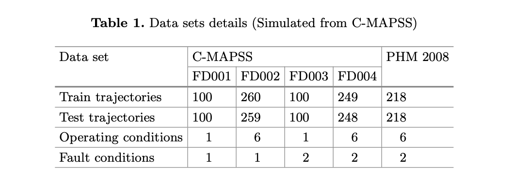
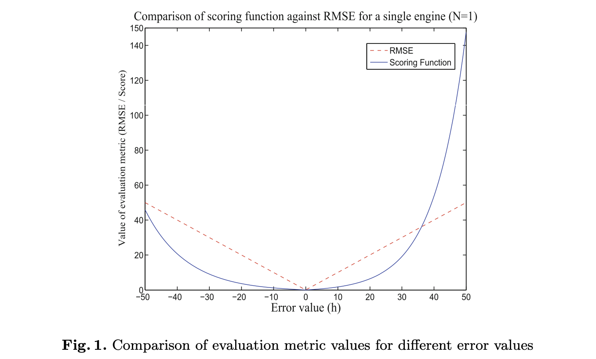
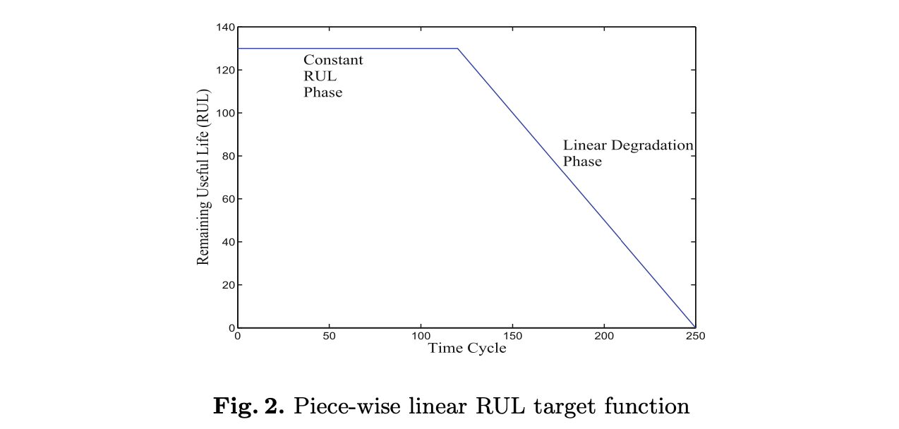
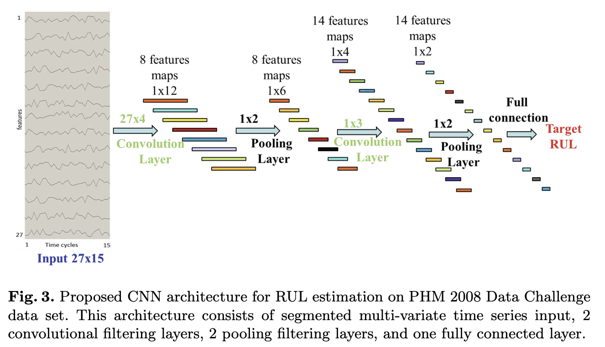
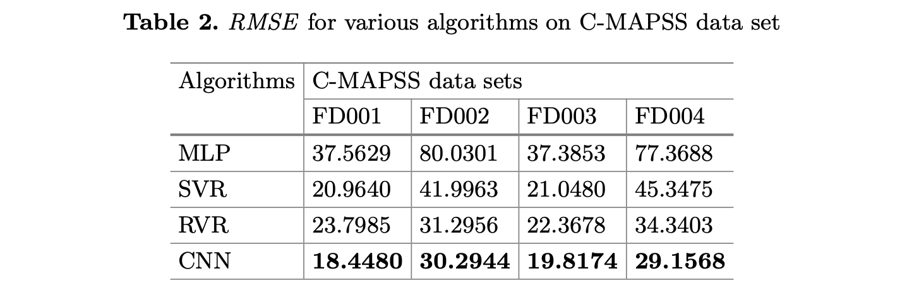
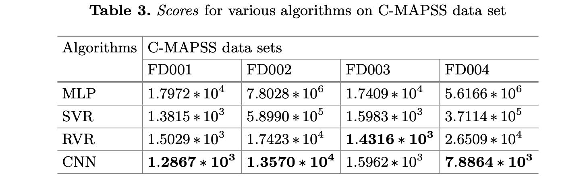
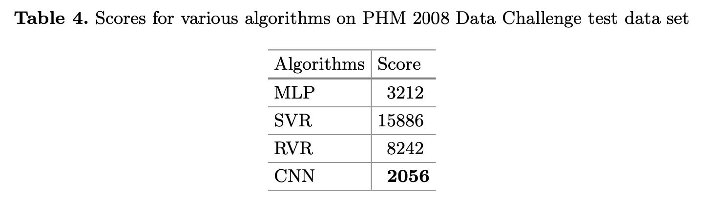

# 题目 #

- **原标题：**
  **Deep Convolutional Neural Network Based Regression Approach for Estimation of Remaining Useful Life**
- **中文翻译：**
  **基于深度卷积神经网络的剩余使用寿命估计回归方法研究**

# 作者

- **Giduthuri Sateesh Babu**  

- **Peilin Zhao**
  
- **Xiao-Li Li**

*Institute for Infocomm Research, A*STAR, Singapore, Singapore {giduthurisb,zhaop,xlli}@i2r.a-star.edu.sg http://www.i2r.a-star.edu.sg*

# 摘要

预测技术旨在使用传感器数据准确估计子系统或组件的剩余使用寿命（RUL），具有许多实际应用。然而，许多现有算法是基于线性模型的，无法捕捉传感器数据和RUL之间的复杂关系。虽然多层感知器（MLP）已经被应用于预测RUL，但由于其网络结构，它不能自动学习显著特征。本文提出了一种基于深度卷积神经网络（CNN）的RUL估计回归方法。尽管CNN已应用于计算机视觉、自然语言处理、语音识别等任务，但将其用于预测RUL还是首次尝试。与用于计算机视觉的现有CNN结构不同，我们方法中的卷积和池化滤波器沿时间维度应用于多通道传感器数据，以系统方式结合来自原始传感器信号的自动特征学习。通过深度架构，学习得到的特征是低级原始传感器信号的高级抽象表示。此外，特征学习和RUL估计通过监督反馈相互增强。我们在两个公开可用的数据集上比较了几种最先进的算法，以评估该方法的有效性。结果表明，我们提出的基于深度卷积神经网络的RUL估计回归方法不仅更有效，而且更准确。

# 关键字

- **多变量时间序列分析  **    Multivariate time series analysis

- **深度学习**    Deep learning

- **卷积神经网络**    Convolutional neural networks

- **监督学习**   Supervised learning

- **回归方法**   Regression methods

- **预测**   Prognostics

- **剩余使用寿命**   Remaining useful life

# 引言

预测技术在各种应用领域的基于状态的维护中非常重要，如制造业、航空航天、汽车、重工业、发电和运输等。当从预定的工作状态下评估退化情况时，预测技术通过预测子系统或者组件的未来性能来进行RUL估计。如果我们能够准确预测发动机什么时候发生故障，那么我们就可以提前做出相应的维护决策，以避免故障，降低维护成本，并简化运营活动。本文提出了一种基于数据驱动的预测方法，用来评估复杂系统的出现故障数据时的剩余使用寿命RUL。文献中用于RUL估计的现有算法都是基于多元分析或损伤进展分析<a href="#ref9">[9，15-17，23]</a> 。然而，如果没有良好的特征表示方法，准确预测RUL是非常具有挑战性的，甚至是不可能准确预测RUL。因此，非常有必要开发一种系统特征表示方法，以有效地表征与预测任务相关信号的特征。

最近，出现了一个名为深度学习的学习模型工具集合，旨在从原始数据中学习更高层次的抽象的特征<a href="#ref2">[2，7]</a>。深度学习模型不需要人们手工标记的任何特征，相反，它们将自动从原始数据学习分层特征的表示。在深度学习框架中，为了可以自动学习特征，设计建立了具有多层的深度架构。具体来说，深度架构中的每一层对前一层的输出进行非线性变换，从而通过深度学习模型，数据可以由不同层次的特征表示。卷积神经网络、自动编码器和深度信念网络是深度学习中最常见的模型。根据标签信息的使用与否，可以分为有监督或无监督两种深度学习模型。深度学习模型在计算机视觉<a href="#ref11">[11]</a>、语音识别<a href="#ref10">[10]</a>和自然语言处理<a href="#ref5">[5]</a>中取得了显著的成果。据我们目前所知，该技术还没有被用于RUL估计的预测领域。

递归神经网络是一类深度学习架构，是可以更直观感知时间序列数据的模型<a href="#ref6">[6]</a>，它适用于时间序列未来状态预测。在本文中，我们将RUL估计问题视为多变量时间序列回归问题，并通过采用一个特定的深度学习模型来解决它，即卷积神经网络（CNN），该深度学习模型广泛适用于图像分类<a href="#ref1">[1，12，13]</a>。本文首次尝试利用深度学习来研究预测问题中的RUL估计。CNN的关键属性是交替进行不同的处理单元（例如卷积、池化、S形/双曲正切压缩、整流器和归一化）。这样设计的各种处理单元可以有效地表示信号的局部显著性。此外，深度架构允许这些处理单元的多个层进行堆叠，从而使该深度学习模型可以表征不同尺度下的信号显著性。因此，CNN提取的特征依赖于任务并非手工标记的数据集。此外，这些特征还可以在预测方面有着更大的作用，因为CNN同样可以在目标值的监督下学习。

最近，不同的CNN架构被应用于多通道时间序列数据的分析，用于分类任务<a href="#ref24">[24–26]</a>中的动态识别问题。在一文献<a href="#ref25">[25]</a>浅层CNN架构仅由一个卷积核和一个池化层组成，并且应用局限于加速度感测计数据。在文献<a href="#ref24">[24，26]</a>中，作者使用了深度CNN架构，在这些架构中，所有卷积和池化滤波器都是一维的，它们分别应用于沿时间上的单个传感器时间序列。与分类任务不同，在作为回归任务的RUL估计中，CNN中的卷积和池化滤波器沿时间维度应用于所有传感器，所有传感器的所有这些特征图都需要统一为神经网络回归器的公共输入。因此本文提出了一种新的CNN架构。在所提出的RUL估计架构中，初始层中的卷积滤波器是二维的，其沿时间方向应用于所有传感器时间序列，神经网络回归层使用平方误差损失函数，这使得所提出的架构不同于现有多通道时间序列数据的CNN架构<a href="#ref24">[24–26]</a>。在实验中，在两个公共数据集上，将所提出的基于CNN的RUL估计方法与现有的基于回归的方法进行了比较。结果清楚地表明，所提出的方法比现有方法更准确地预测RUL。

本文的结构如下：第2节简要描述了问题背景，包括用于评估不同算法有效性的数据集、评估度量和数据预处理步骤。第3节描述了我们提出的用于RUL估计的基于深度结构CNN的回归方法。接下来，第4节介绍了所提出的方法与RUL估计的标准回归算法的性能比较。第5节为这项工作的结论的总结。

# 问题设置（Problem Settings）

在预测学中，估计部件或子系统（如飞机发动机）的RUL是一个重要问题。通常，一些传感器（例如振动传感器）用于收集其信息，作为估计RUL的特征。按规定，假设采用具有分量索引 $i$ 的 $d$ 个传感器，故可以得到多元的时间序列数据 $X^i \in \mathbb{R}^{d \times n_i}$ ，其中，$X^i$ 的第 $ j$ 列表示为 $X^i_j \in \mathbb{R}^d$，是由第 $j$ 个时间周期内来自 $d$ 个传感器的信号组成的向量，$X^i_{n_i}$ 表示部件发生故障时信号 $n_i$ 的向量，$n_i$ 是部件 $i$ 从开始的有效寿命。假设我们有 $N$ 个相同的类别组件，例如，$N$ 个引擎，那么我们可以收集如 $\left\{  X_j^i|i=1,...,M;j=n_1,...,n_N      \right\} $ 这样的训练集。然后，任务是基于给定的训练集构造模型，并对测试集 $\left\{  Z^i \in \mathbb{R}_{d \times m_i}|i=1,...,M \right\}$ 执行RUL估计，其中 $Z_j^i，j=1,...,m_i$ 是组件工作正常时的信号。这里，测试集中组件 $ i$ 的RUL是从故障前的第 $m$ 个时间周期开始，它正常工作的剩余时间周期数。现在让我们介绍两个基准数据集。

**数据集：** 本工作选择了两个数据集，即 NASA 的C-MAPSS（商用模块化航空推进系统模拟）数据集和 PHM 2008数据挑战数据集<a href="#ref19">[19]</a>。C-MAPSS数据集进一步划分为4个子数据集，如表1所示。两个数据集都包含使用 NASA 开发的基于模型的模拟程序C-MAPSS生成的模拟数据<a href="#ref20">[20]</a>。

两个数据集以 $n$ 乘26矩阵的形式排列，其中 $n$ 对应于每个组件中的数据点的数量。每一行是在单个运行时间周期内采集的数据快照，共有26列，其中第1列表示发动机编号，第2列表示运行周期编号，3–5列表示三个运行设置，6–26列表示21个传感器值。有关21个传感器的更多信息，请参见<a href="#ref22">[22]</a>。数据中的三个操作设置会显著影响发动机性能。假设列车和测试轨迹内的每个轨迹都是发动机的生命周期。当每台发动机在不同初始条件下进行模拟时，这些条件被认为是正常条件（无故障）。对于训练集中的每个发动机轨迹，最后一个数据输入对应于发动机被宣布为不健康或故障状态的时刻。另一方面，测试集包含故障前一段时间的数据，这里的目的是预测每个发动机测试集中的RUL。对于每个C-MAPSS数据集，测试轨迹的实际RUL值已向公众提供，而PHM 2008数据挑战数据集中的测试轨迹的真实RUL值不可用。

为了公平地比较测试数据上的估计模型性能，我们需要一些客观的性能度量。在这项工作中，我们主要采用两种度量：评分函数和均方根误差（RMSE），详细介绍如下:

**评分函数：**本文中使用的评分函数与PHM 2008数据挑战赛中使用的相同。该评分函数如等式(1) 所示，其中 $N$ 是测试集中的发动机数量，$S$ 是计算的分数，$h=(估计RUL−真实RUL)$。
$$
S= \left\{\begin{matrix}
  \sum^N_{i=1}(e^{-\frac{h_i}{13}}-1) & for & h_i < 0 \\
  \sum^N_{i=1}(e^{-\frac{h_i}{10}}-1) & for & h_i \ge 0
\end{matrix}\right.
$$
与早期预测相比，该评分功能对后期预测（太晚而无法执行维护）的惩罚更大（虽然它可能会浪费维护资源，但没有太大的危害）。这符合航空航天行业的风险不利态度。然而，该功能有几个缺点。最显著的缺点是单个离群值（预测时间较晚）将主导总体性能得分（请参考图1右侧的指数增长），从而掩盖了算法的真实总体精度。另一个缺点是没有考虑算法的预测范围。预测范围评估失效前的时间，该算法能够在一定的置信水平内准确估计RUL值。最后，该评分函数支持通过低估RUL来人为降低分数的算法。尽管存在所有这些缺点，本文仍然使用评分函数来提供与文献中其他方法的比较结果。

**RMSE:**  除评分函数外，估计RUL的均方根误差（RMSE）也被用作性能度量。之所以选择RMSE，是因为它对早期和晚期预测都给予了同等的权重。将RMSE与评分函数结合使用将避免倾向于通过低估分数而人为降低分数但导致更高RMSE的算法。RMSE定义如下：
$$
RMSE = \sqrt{\frac{1}{N} \sum_{i=1}^N h_i^2}
$$
两个评估指标之间的比较图如图1所示。可以观察到，在较低的绝对误差值下，评分函数导致比RMSE更低的值。这两个评估指标的相对特征将在本文后面部分讨论实验结果时有用。

此外，为了学习模型，我们需要执行一些数据预处理，详细信息如下:

**操作条件设置：**一些文献<a href="#ref19">[9,16,23]</a>表明，通过绘制3个操作设置值，数据点被聚类为六个不同的聚类。该观察结果仅适用于具有不同操作条件的数据集，但C-MAPSS数据集中FD001和FD003 的数据点都聚集在一个点上，它们是单个操作条件子数据集。假设这些集群对应于六种不同的操作条件。

因此，可以将操作条件历史记录作为特征。通过添加6列数据（多个操作条件数据集)，对FD002、FD004和PHM 2008数据Chal-lenge数据集进行此操作，这些数据表示自系列开始以来在各自操作条件下花费的周期数<a href="#ref16">[16]</a>。

**数据规范化：**由于6种操作条件，每种操作条件都会导致不同的传感器值。因此，在任何训练和测试之前，必须进行数据归一化，以便使用等式(3) 使数据点处于统一的尺度范围内。由于标准化是在每个传感器和每个操作条件的统一刻度范围内进行的，这将确保所有操作条件下所有特征的贡献相等<a href="#ref16">[16]</a>。或者，也可以将操作条件信息纳入数据中，以考虑各种操作条件。
$$
Norm(x^{c,f})=\frac{x^{(c,f)}-\mu^{(c,f)}}{\sigma^{(c,f)}},\forall c,f
$$
其中 $c $表示操作条件；$f$ 表示原始21个传感器中的每一个。$\mu^{(c,f)}$ 为均值，$\sigma^{(c,f)}$ 是工况 $c$ 下的标准差。

**RUL目标函数：**在其最简单的形式中，预测算法类似于回归问题。然而，与典型的回归问题不同，数据驱动的预测问题的固有挑战是确定每个输入数据点的期望输出值。这是因为在实际应用中，如果没有精确的基于物理的模型，就不可能准确地确定每个时间步的系统健康状态。一个合理的解决方案是简单地将所需输出分配为功能故障之前的实际剩余时间[<a href="#ref16">[16]</a>。然而，这种方法无意中暗示了系统的健康状况随着使用而线性下降。另一种方法是基于合适的退化模型导出期望的输出值。对于该数据集，<a href="#ref19">[9]</a>中提出了分段线性退化模型，该模型限制了RUL函数的最大值，如图2 所示。根据观测结果选择最大值，每个数据集的数值不同。

这两种方法都有各自的优点。分段线性RUL目标函数更有可能防止算法高估RUL。此外，这也是一个更符合逻辑的模型，因为系统的降级通常只在一定程度的使用之后才开始。另一方面，线性RUL函数遵循最严格意义上的RUL定义，即故障时间。因此，系统剩余时间与经过时间的关系图自然会产生一个线性函数。然而，应注意的是，在无法获得适当退化模型的知识的情况下，线性模型是最自然的选择。

# 基于深度卷积神经网络的RUL估计

本节介绍用于从多变量时间序列传感器信号进行RUL估计的深度学习CNN的架构。除了与操作条件历史相对应的提取特征外，输入是标准化传感器信号。目标值是系统在相应时间周期的RUL。所考虑的目标RUL函数是一个分段线性函数，如前几节所述。卷积神经网络具有识别传感器信号的各种显著模式的巨大潜力。具体来说，较低层处理单元获得信号的局部显著性。更高层的处理单元以高级表示获得信号的显著模式。注意到，每一层可能有许多卷积或池运算符（由不同的参数指定），如下所述，因此在CNN中共同考虑了从不同方面学习到的多个显著模式。当这些具有相同参数的算子在不同时间段应用于局部信号（或其映射）时，获得了一种形式的平移不变性<a href="#ref2">[2，7，8]</a>。因此，重要的只是信号的显著模式，而不是它们的位置或尺度。然而，在RUL估计中，我们面临多个时间序列信号信道，其中传统的CNN不能直接使用。我们问题中的挑战包括（i）CNN中的处理单元需要沿时间维度应用，以及（ii）在多个传感器之间共享或统一CNN中的单元。在下文中，我们将沿着时间维度定义卷积和池化滤波器，然后介绍RUL估计中使用的CNN的整个架构。

#### 层次结构

我们从CNN中使用的记号开始。采用滑动窗口策略将时间序列信号分割成一组短信号。明确地CNN使用的一个例子是一个二维矩阵，其中包含 $r$ 个数据样本，每个样本具有 $D$ 属性（在单个操作条件子数据集的情况下，$D$ 属性被视为 $D$ 个原始传感器信号，在多个操作条件子数据库的情况下 $D$ 属性包括 $D$ 个原始的传感器信号以及与操作条件历史相对应的提取特征，如问题设置部分的操作条件小节所述）。这里，$r $ 被选择为采样率（实验中使用的15个，因为测试发动机轨迹之一只有15个时间周期数据样本），滑动窗口的步长被选择为1。可以选择更大的步长以减少实例的数量，从而降低计算成本。对于训练数据，矩阵实例的真实RUL由最后一条记录的真实RUR确定。

在图3所示的这一拟议架构中，传统的CNN被修改并应用于多变量时间序列回归，如下所示：在每个分段的多变量时间系列上，我们联合执行特征学习。在特征学习结束时，我们连接了一个用于RUL估计的普通多层感知器（MLP）。特别是在这项工作中，我们使用了2对卷积层和池化层，以及一个正常的完全连接的多层感知器。它包括 $D$ 通道输入，每个输入的长度为15。这一分段的多变量时间序列（$D$ ×15）被送入卷积和汇集层的2个阶段。然后，我们将所有端层特征映射连接到一个向量中，作为RUL估计的MLP输入。训练阶段包括通过使用随机梯度下降法的标准反向传播算法估计CNN参数，以优化目标函数，即CNN模型的累积平方误差。

**卷积层：** 在卷积层中，前一层的特征图与几个卷积核卷积（在训练过程中学习）。通过激活函数计算由偏置（待学习）和下一层的特征图相加的卷积算子的输出。卷积层的输出特征图计算如下：
$$
X_j^l=sigm(z_j^l),z_j^l=\sum_i x_i^{l-1} * k_{ij}^l +b_j^l
$$
其中*表示卷积算子，$x_i^{l-1}$ 和 $x^l_j$ 是卷积ij滤波器输入和输出，sigm() 表示Sigmoid函数，$z^l_j$ 是非线性Sigmoid函数的输入。Sigmoid函数因其简单而被使用。我们在第一卷积层中应用尺寸为 $D$ ×4的卷积滤波器。在第二卷积层中，我们应用大小为1×3的卷积滤波器。

**池化层：**在池化层中，通过适当的因子对输入特征进行子采样，从而降低特征图分辨率，以增加特征对输入上的失真的不变性。我们在工作的所有阶段使用平均池而不重叠。输入特征图由平均池划分，并生成一组非重叠区域。对于每个子区域，输出为平均值。池层输出特征图计算如下：
$$
x_j^{l+1} = down(x_j^l)
$$
其中 $x_j^l$ 是输入，$x^{l+1}_j$ 是池化层的输出，$down(.)$ 表示平均池化的子采样函数。我们在第一和第二池化层中应用大小为1×2的池化过滤器。

#### 训练流程

与回归任务的传统MLP训练一样，我们在基于CNN的架构中使用平方误差损失函数，定义如下：$ E=\frac{1}{2}(y(t)-y*(t)^2)$ ，其中$y*(t)$是预测的RUL值，$y(t)$为第 $t$ 个训练样本的目标RUL。在我们的CNN模型的训练中，我们使用基于随机梯度下降的优化方法来估计网络的最优参数，并使用反向传播算法来最小化损失函数<a href="#ref14">[14]</a>。训练过程包括前向传播、后向传播和梯度应用三个级联阶段。

**正向传播：**正向传播的目的是在分段多变量时间序列输入上确定CNN模型的预测输出。具体地，计算每个层输出特征图。如前几节所述，每个阶段都包含卷积层，然后是池化层。我们分别使用等式（4）和（5）计算卷积和池化层的输出。最终，单个完全连接的层与特征提取器连接。

**反向传播：**一旦前向传播的一次迭代完成，我们将得到误差值，以及平方误差损失函数。预测误差从最后一层传播回第一层的每一层参数，通常应用于此过程的导数链。

对于第二级池化层中误差的反向传播，$x_j^{l−1}$的导数由上采样函数$up(.)$ 计算，这是子采样函数$down(.)$的逆运算。
$$
\frac{\partial E}{\partial x_j^{l-1}} = up(\frac{\partial E}{\partial x_j^l})
$$
在第二阶段特征提取层中，$z_j^l$ 的导数在MLP的隐藏层中计算相同。
$$
\eth _j^l = \frac{\partial E}{\partial z_j^l}=
\frac{\partial E}{\partial x_j^l}
\frac{\partial x_j^l}{\partial z_j^l}=
sigm'(z_j^l) \odot up()
\frac{\partial E}{\partial x_j^{l+1}}
$$
在上述方程中，按元素表示的乘积用 $⊙$ 符号表示，通过将 $\eth_j^l$ 中的所有值相加计算偏差导数，如下所示：
$$
\frac{\partial E}{\partial b_j^l} = \sum_u (\eth_j^l)_u
$$
通过对与核相关的所有值求和来计算核权重 $k^l_{ij} $的导数，并通过如下给出的卷积运算来计算：
$$
\frac{\partial E}{\partial k_{ij}^l}=
\frac{\partial E}{\partial z_j^l}
\frac{\partial z_j^l}{\partial k_{ij}^l} = 
\eth _j^l *reverse(x_i^{l-1})
$$
其中$reverse(.)$ 是反转相应特征提取器的函数。最后，我们计算 $x_j^{l−1}$ 的导数，如下所示：
$$
\frac{\partial E}{\partial x_i^{l-1}} = 
\sum_j \frac{\partial E}{\partial z_j^l}
\frac{\partial z_j^l}{\partial x_i^{j-l}} = 
\sum_j pad(\eth_j^l) *reverse(k_{ij}^l)
$$
在上面的等式中，$pad(.)$ 表示填充函数，它在两端将 0 填充到 $δ_j^l$。具体来说，$pad(.)$ 函数将在 $δ_j^l$ 的每一端填充 $n^l_2−1$个零，其中 $n^l_2$ 是 $k^l_{ij}$ 的大小。

**梯度下降算法应用：** 在计算参数导数的值之后，我们可以应用它们来更新参数。假设我们希望最小化的成本函数是 $E(w)$。梯度下降告诉我们修改 $E$ 中最陡下降方向的权重 $w$：
$$
w^l_{ij} = w^l_{ij} - \eta \frac{\partial E}{\partial w^l_{ij}}
$$
其中 $η$ 是学习率，学习率是一个参数，它决定了更新步骤对当前权重值的影响程度，如果它太大，则会对权重   $w_{ij}$ 进行相应的较大修改。关于正向传播、反向传播和梯度应用的更多细节，请参见<a href="#ref3">[3,14]</a>。

# 实验结果

在本节中，我们对我们提出的基于CNN的回归模型（简称CNN）与最新的三种回归算法（包括多层感知器（MLP）<a href="#ref18">[18]</a>、支持向量回归（SVR）<a href="#ref4">[4]</a>和相关向量回归（RVR）<a href="#ref21">[21]</a>在两个公开可用的数据集上进行了广泛的实验比较。所有四种技术（即CNN、MLP、SVR和RVR）的可调参数均使用仅基于训练集的标准5倍交叉验证程序进行选择，其中我们调整其参数值以在随机选择的四个折叠上训练这些模型，并选择在最后一个折叠中给出最佳结果的最终值。

#### 基于C-MAPSS数据集的实验结果

在四个C-MAPSS子数据集上测试了四种算法（见表1）。表2根据RMSE值说明了四个子数据集的比较结果。观察到，无论操作条件如何，CNN在所有子数据集上始终获得比MLP、SVR和RVR更低的RMSE值，这表明所提出的深度学习方法可以找到比浅层特征和原始MLP网络中的特征更多的信息特征。

在这四种方法中，MLP在所有四个子数据集上的RMSE值都高于其他方法，这表明天真的深度模型甚至会损害性能，并进一步验证了探索现代深度学习技术的必要性。SVR在单个工况数据集（即第一和第三子数据集）上实现了比MLP和RVR更低的RMSE值。此外，RVR在多个工况数据集（即第二和第四子数据集）上实现了比MLP和SVR更低的RMSE值。这表明，现有的传统方法中没有一种能够始终如一地击败其他方法，而我们提出的CNN方法在多个数据集上始终取得显著更好的结果。

同样，在相同的C-MAPSS数据集中，表3描述了所有四种方法在评估分数方面的比较结果，如图1中的评分函数所示。据观察，CNN在多工况数据集（即第二和第四子数据集）以及1个单工况数据集，即第一子数据集上，获得的分数值低于（更好）MLP、SVR和RVR。在四种方法中，无论操作条件如何，MLP在所有四个子数据集上的得分值（最差结果）都高于其他方法。尽管RMSE值较低，但CNN在一个单一工况数据集（即第三个子数据集）上的得分略高于RVR（更差）。再加上每个评估指标的特征（图1），这意味着得分稍高可能是由预测RUL时的某些异常值造成的。基于这些观察，我们发现RUL估计方法的性能也取决于它们的操作条件。

#### 基于PHM 2008数据挑战数据集的实验结果

最后，我们还在PHM 2008数据挑战测试数据集上评估了四种算法的性能。在我们执行了4种算法来计算测试数据集中218台发动机的估计RUL之后，它们被上传到NASA数据存储库网站，然后网站计算出一个分数作为最终输出。

我们可以从表4中的结果中观察到，我们提出的基于CNN的应用程序显著优于现有的基于回归方法的方法，产生了更低的分数（见图1），表明我们提出的CNN模型的预测失效时间非常接近实际失效时间或其地面真实值。因此，我们可以得出结论，基于CNN的回归方法优于基于标准浅层架构的回归方法，用于RUL估计。

# 总结

准确的RUL估计在不同行业的许多实际应用中具有巨大的好处和优势。本文首次尝试将深度学习应用于预测问题中的剩余使用寿命（RUL）估计，研究了一种新的、基于深度结构CNN的回归器，用来从多变量时间序列数据中估计复杂系统的RUL。我们提出的深度架构主要采用卷积和池化层来捕获不同时间尺度上传感器信号的显著特征。所有识别出的显著特征都被系统地统一，并最终映射到评估模型中的RUL中。为了评估所提出的算法，我们检查了它在两个公共数据集上的经验性能，我们的实验结果表明，它显著优于文献中广泛用于RUL估计的现有最先进的浅层回归模型。在我们未来的研究中，我们希望进一步探索新的深度学习技术，以解决预测领域中出现的各种现实问题。

# 参考文献

<a name="ref1">[1] Bengio, Y., Courville, A., Vincent, P.: Representation learning: a review and new perspectives. IEEE Trans. Pattern Anal. Mach. Intell. 35(8), 1798–1828 (2013)</a>

<a name="ref2">[2] Bengio, Y.: Learning deep architectures for AI. Found. Trends Mach. Learn. 2(1), 1–127 (2009)  </a>

<a name="ref3">[3] Bouvrie, J.: Notes on convolutional neural networks, November 2006. http:// cogprints.org/5869/1/cnn tutorial.pdf </a>

<a name="ref4">[4] Chang, C.C., Lin, C.J.: LIBSVM: a library for support vector machines. ACM Trans. Intell. Syst. Technol. 2, 27:1–27:27 (2011). http://www.csie.ntu.edu.tw/ ∼cjlin/libsvm </a>

<a name="ref5">[5] Collobert, R., Weston, J.: A unified architecture for natural language processing: deep neural networks with multitask learning. In: Proceedings of the 25th Inter- national Conference on Machine Learning, pp. 160–167. ACM (2008) </a>

<a name="ref6">[6] Connor, J.T., Martin, R.D., Atlas, L.E.: Recurrent neural networks and robust time series prediction. IEEE Trans. Neural Netw. 5(2), 240–254 (1994)</a>

<a name="ref7">[7]Deng, L.: A tutorial survey of architectures, algorithms, and applications for deep learning. APSIPA Trans. Sig. Inf. Process. 3, 29 (2014)</a>

<a name="ref8">[8] Fukushima, K.: Neocognitron: a self organizing neural network model for a mech- anism of pattern recognition unaffected by shift in position. Biol. Cybern. 36(4), 193–202 (1980)</a>

<a name="ref9">[9] Heimes, F.O.: Recurrent neural networks for remaining useful life estimation. In: International Conference on Prognostics and Health Management, PHM 2008, pp. 1–6, October 2008</a>

<a name="ref10">[10] Hinton, G., Deng, L., Yu, D., Dahl, G.E., Mohamed, A., Jaitly, N., Senior, A., Vanhoucke, V., Nguyen, P., Sainath, T.N., et al.: Deep neural networks for acoustic modeling in speech recognition: the shared views of four research groups. IEEE Sig. Process. Mag. 29(6), 82–97 (2012).</a>

<a name="ref11">[11]Krizhevsky, A., Sutskever, I., Hinton, G.E.: Imagenet classification with deep con- volutional neural networks. In: Advances in Neural Information Processing Sys- tems, pp. 1097–1105 (2012)</a>

<a name="ref12">[12] LeCun, Y., Kavukcuoglu, K., Farabet, C.: Convolutional networks and applications in vision. In: Proceedings of 2010 IEEE International Symposium on Circuits and Systems (ISCAS), pp. 253–256, May 2010</a>

<a name="ref13">[13] LeCun, Y., Bengio, Y.: Convolutional networks for images, speech, and time series. In: Arbib, M.A. (ed.) The Handbook of Brain Theory and Neural Networks, pp. 255–258. MIT Press, Cambridge (1998)</a>

<a name="ref14">[14] LeCun, Y., Bottou, L., Orr, G.B., Mu ̈ller, K.-R.: Efficient BackProp. In: Orr, G.B., Mu ̈ller, K.-R. (eds.) NIPS-WS 1996. LNCS, vol. 1524, p. 9. Springer, Heidelberg (1998) </a>

<a name="ref15">[15] Lim, P., Goh, C.K., Tan, K.C., Dutta, P.: Estimation of remaining useful life based on switching kalman filter neural network ensemble. Ann. Conf. Prognostics Health Manag. Soc. 2014, 1–8 (2014) </a>

<a name="ref16">[16] Peel, L.: Data driven prognostics using a kalman filter ensemble of neural net- work models. In: International Conference on Prognostics and Health Management, PHM 2008, pp. 1–6, October 2008 </a>

<a name="ref17">[17] Ramasso, E., Saxena, A.: Review and analysis of algorithmic approaches developed for prognostics on CMAPSS dataset. Ann. Conf. Prognostics Health Manag. Soc. 2014, 1–11 (2014) </a>

<a name="ref18">[18]Rumelhart, D.E., Hinton, G.E., Williams, R.J.: Learning representations by back-propagating errors. In: Anderson, J.A., Rosenfeld, E. (eds.) Neurocom- puting: Foundations of Research, pp. 696–699. MIT Press, Cambridge (1988). http://dl.acm.org/citation.cfm?id=65669.104451</a>

<a name="ref19">[19] Saxena, A., Goebel, K.: PHM08 challenge data set. NASA AMES prognostics data repository. Technical report, Moffett Field, CA (2008) </a>

<a name="ref20">[20] Saxena, A., Goebel, K., Simon, D., Eklund, N.: Damage propagation modeling for aircraft engine run-to-failure simulation. In: International Conference on Prognos- tics and Health Management, PHM 2008, pp. 1–9, October 2008</a>

<a name="ref21">[21] Tipping, M.E.: The relevance vector machine. In: Solla, S.A., Leen, T.K., Mu ̈ller, K.R. (eds.) Advances in Neural Information Processing Systems, vol. 12, pp. 652–658. MIT Press, Cambridge (2000) </a>

<a name="ref22">[22] Wang, P., Youn, B.D., Hu, C.: A generic probabilistic framework for structural health prognostics and uncertainty management. Mech. Syst. Sig. Process. 28, 622–637 (2012)</a>

<a name="ref23"> [23] Wang, T., Yu, J., Siegel, D., Lee, J.: A similarity-based prognostics approach for remaining useful life estimation of engineered systems. In: International Conference on Prognostics and Health Management, PHM 2008, pp. 1–6, October 2008</a>

<a name="ref24">[24] Yang, J.B., Nguyen, M.N., San, P.P., Li, X.L., Krishnaswamy, S.: Deep convo- lutional neural networks on multichannel time series for human activity recogni- tion. In: Proceedings of the 24th International Conference on Artificial Intelligence, pp. 3995–4001. AAAI Press (2015)</a>

<a name="ref25">[25] Zeng, M., Nguyen, L.T., Yu, B., Mengshoel, O.J., Zhu, J., Wu, P., Zhang, J.: Convolutional neural networks for human activity recognition using mobile sensors. In: 6th International Conference on Mobile Computing, Applications and Services (MobiCASE), pp. 197–205. IEEE (2014)</a>

<a name="ref26">[26] Zheng, Y., Liu, Q., Chen, E., Ge, Y., Zhao, J.L.: Time series classification using multi-channels deep convolutional neural networks. In: Li, F., Li, G., Hwang, S., Yao, B., Zhang, Z. (eds.) WAIM 2014. LNCS, vol. 8485, pp. 298–310. Springer, Heidelberg (2014) </a>

